# CardDrop

## What is CardDrop

CardDrop is a 3d printed modular card scanner assistant for Magic The Gatering Cards. Tested whit [ManaBox App](https://manabox.app/).

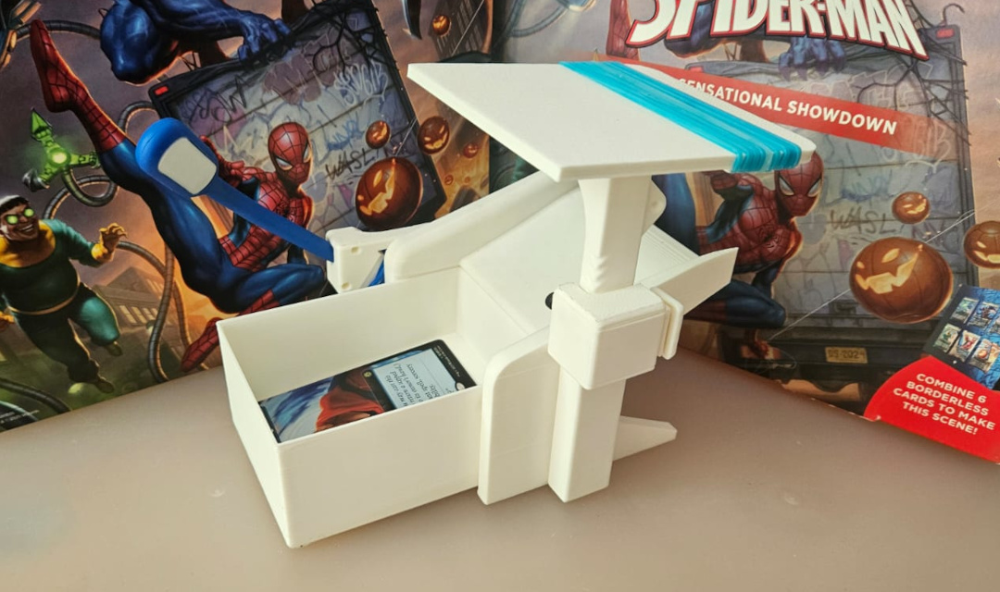

You can get the plans in [Onshape](https://cad.onshape.com/documents/3e6c0a39159cacd4128026c6/w/4eaf27fd4c1ac576c02eefac/e/cf0dfa73e00b3c8fb2858fbe?renderMode=0&uiState=69010f9acb89d229bf5b442d)

# Updates

- 2025-10-29 - v3.5 Initial Public Version.

# Print

* Tested in Bambulabs A1 Mini
    * 0.16 mm Optimal is recomended for 0.4 Nozzle
    * 0.18 mm Fine is recomended for 0.6 Nozzle 
* Can be printed whitow supports
* A 4 mm brim is recomended for the phone stand base

Files:  

* Main Body
    * [Body](files/body.stl)
* Box - Chose 1 or more
    * [Box Universal](files/box_universal.stl) (Recomended)    
        * Recomended for sleeve cards (Dragonshields and similars)
        * Good for unsleeve cards, perfect fit or similars
    * [Box Small](files/box_small.stl)   
        * Recomended for unsleeve cards, perfect fit or similars
    * [Box Sleeved](files/box_sleeved.stl)  
        * Only for sleeve cards (Dragonshields and similars)
* Phone Stand   
    * [Stand](files/phone_stand.stl)
    * [Base](files/phone_stand_base.stl)
    * [Button](files/phone_stand_base_-_button.stl)  
    * [Top](files/phone_stand_base_-_top.stl)
    * [Spring](files/phone_stand_base_-_spring.stl)  
* Light   
    * Option A (Recomended)
        * [Base](files/a_light_flex_-_base.stl)     
        * [Press](files/a_light_flex_-_press.stl)    
        * [Cover](files/a_light_flex_-_cover.stl)  
    * Option B
        * [Clip](files/b_light_clip.stl)      
        * [Cable Clip](files/b_light_cable_clip.stl)  
        * [Diffuser](files/b_light_diffuser.stl) (Print whit 100% rectilinear infill)   
* Optionals
    * [Caps left/right side](files/caps_side.stl)      
    * [Caps back](files/caps_front.stl)     

# Modules

## Main Body

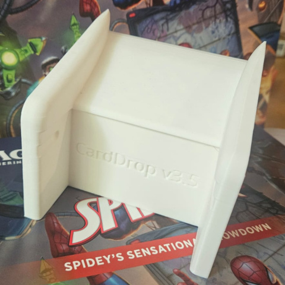

The main body has 4 locks for modules

* Dimple Locks in the front (for boxes)
* Left Clip  
* Right Clip 
* Back Clip

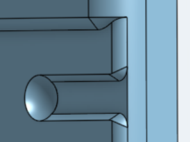
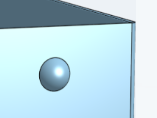
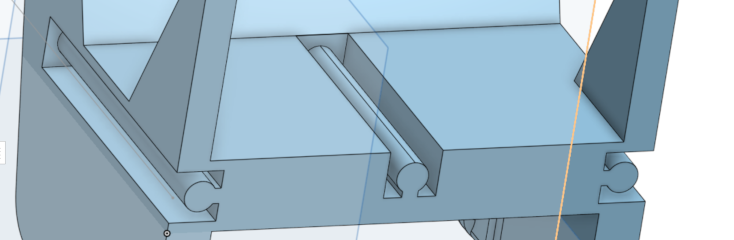

## Phone Stand

Features  

* Adjustable height with a locking button
* 7.5 degrees of inclination for better phone view
* Rubber Bands support for anti-slip
* Rail Clip for expansions

What you need

* 9 rubber bands (optional)
* Small M3 screw (option 1)
* SuperGlue/Loctite (option 2)

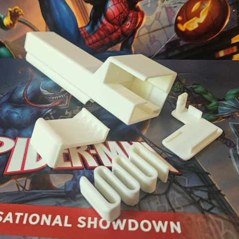
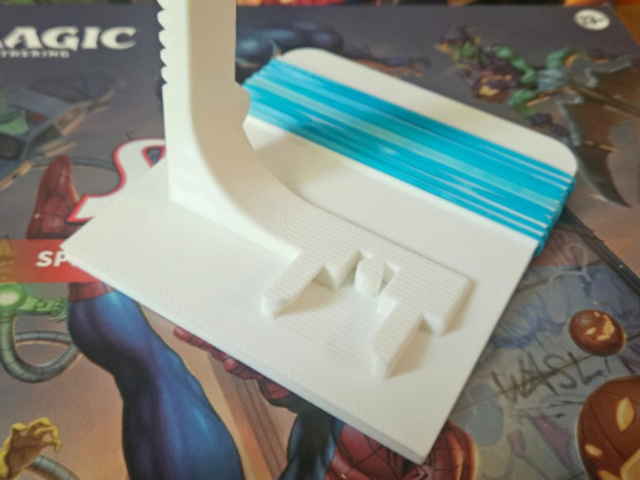
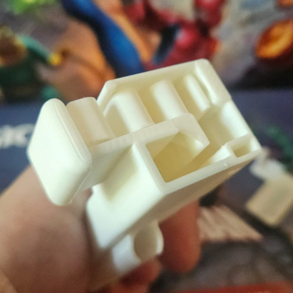
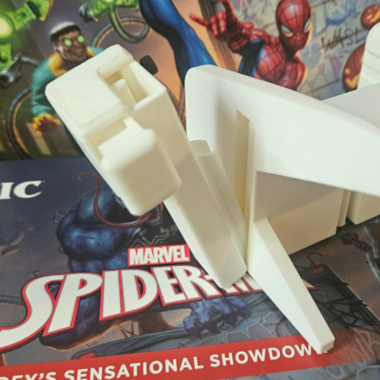

## Box Universal (option A) (recomended)

Recomended for sleeve cards (Dragonshields and similars)

Support for unsleeve cards is good but not perfect, sometimes you can see part of the previus card and dat confuses the scanner, a 7.5 angle in the base of the box is created as a non perfect mitigation for this problem.

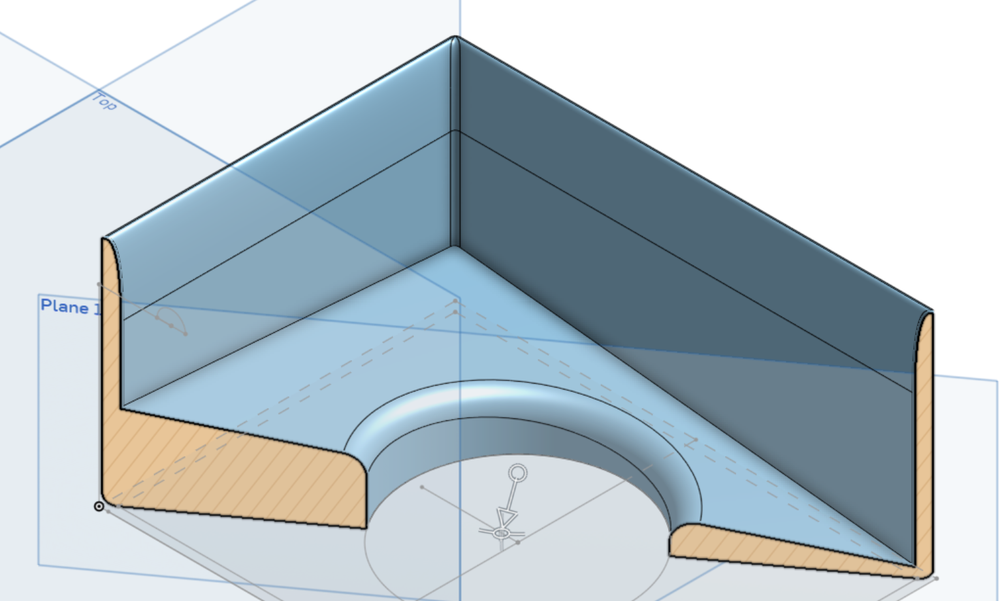

## Box Small (option B)

Recomended for unsleeve cards and "perfect fit" sleeves or similar  

## Box Sleeved (option C)

Optimized for sleeved cards, Dragon Shield or similar. Universal Box is Recomended.

## Light (option A) (recomended)

What you need

* Flexible USB light
    * Amazon USA [link](https://www.amazon.com/-/es/Kyfreshpower-flexible-nocturna-compatible-computadora/dp/B09ZQSD1HX/ref=sr_1_6?__mk_es_US=%C3%85M%C3%85%C5%BD%C3%95%C3%91&sr=8-6)
    * Mercadolibre Argentina [link](https://articulo.mercadolibre.com.ar/MLA-904784238-luz-led-lampara-notebook-portatil-flexible-usb-linterna-_JM?searchVariation=174994919097#polycard_client=search-nordic&searchVariation=174994919097&search_layout=stack&position=3&type=item&tracking_id=c5f1e52d-9db7-45ab-b59f-fe4a51991974)
    * Aliexpress [link](https://es.aliexpress.com/item/1005010212112114.html)
* Rubber band

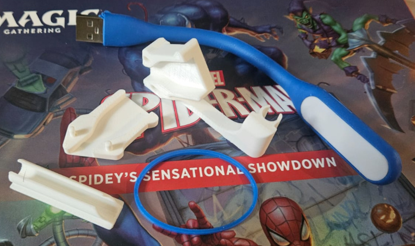
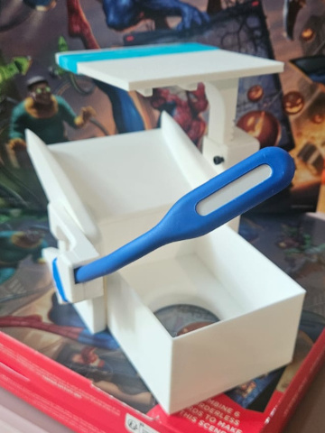

## Light (option B) 

What you need

* 10 mm magnet, 2 mm of height.
* SuperGlue/Loctite (for the magnet)
* Cob rechargeable keychain light
    * Amazon USA [link](https://www.amazon.com/gp/aw/d/B0BL96CN37/?_encoding=UTF8&pd_rd_plhdr=t&aaxitk=ce103c393008308b57130dafb2e3f68b&hsa_cr_id=0&sr=1-2-f02f01d6-adaf-4bef-9a7c-29308eff9043&ref_=sbx__sbtcd2_asin_1_img)
    * Mercadolibre Argentina [link](https://articulo.mercadolibre.com.ar/MLA-2178066708-mini-linterna-led-cob-llavero-recargable-magnetico-potente-_JM?searchVariation=184274818784)
    * Aliexpress [link](https://es.aliexpress.com/item/1005008715044343.html)

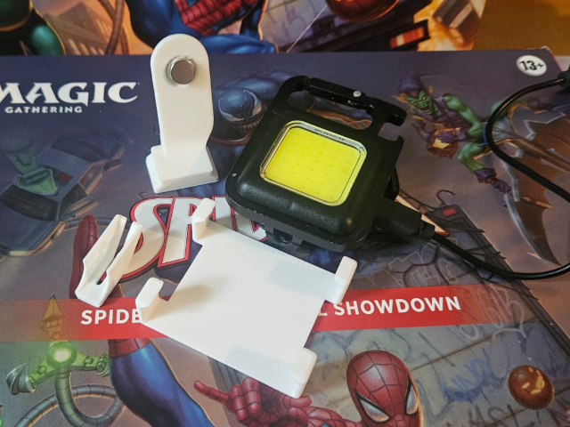
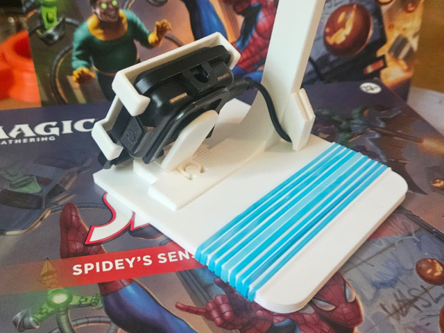
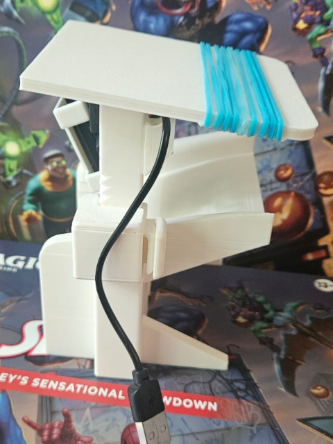

# Create your own modules / Remixes

You can see the plans in [Onshape](https://cad.onshape.com/documents/3e6c0a39159cacd4128026c6/w/4eaf27fd4c1ac576c02eefac/e/cf0dfa73e00b3c8fb2858fbe?renderMode=0&uiState=69010f9acb89d229bf5b442d)

For basic modules, the clip plans are this:

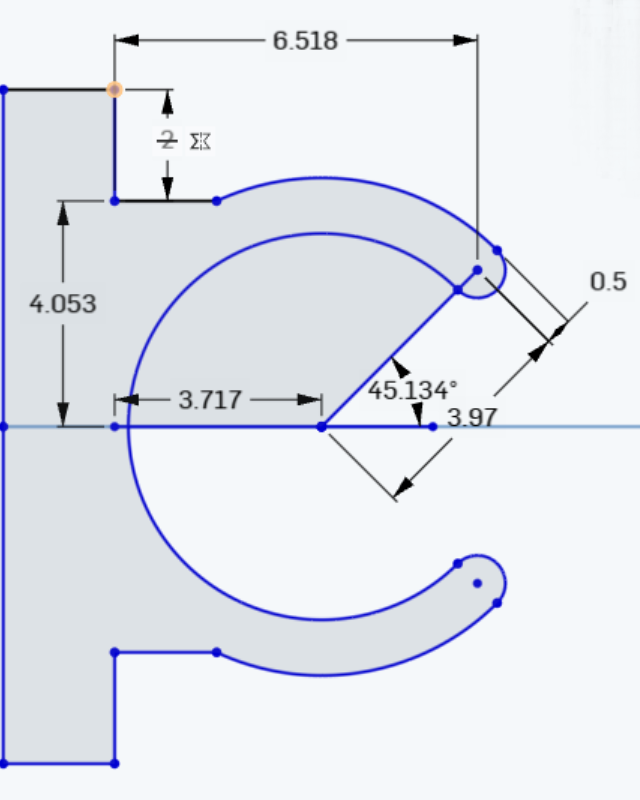

Height is 45 mm for the back clip, 60 mm for the laterals.

Reference model in this [link](files/clip.stl)    

For the slider clip (for the phone stand) you can use this reference model [link](files/slider_clip.stl)      

# License

Original design by Diego Vazquez - CC BY-SA 4.0 license - [Link](https://creativecommons.org/licenses/by-sa/4.0/deed.en). Modifications under the same license.

Notes:

* Remix Allowed over the same licence.
* You can print and sell this design, please, give appropriate credit.
* You can create you own modules, please, keep the same license.

