# CardDrop

## Table of Contents

- [What is CardDrop](#what-is-carddrop)
- [Updates](#updates)
- [Print](#print)
- [Modules](#modules)
  - [Main Body](#main-body)
  - [Phone Stand](#phone-stand)
  - [Box Comparison](#box-comparison)
  - [Box Universal (Option A)](#box-universal-option-a-recommended)
  - [Box Small (Option B)](#box-small-option-b)
  - [Box Sleeved (Option C)](#box-sleeved-option-c)
  - [Box Small Fast (Option D)](#box-small-fast-option-d)
  - [Light (Option A)](#light-option-a-recommended)
  - [Light (Option B)](#light-option-b)
- [Create your own modules / Remixes](#create-your-own-modules--remixes)
- [License](#license)

## What is CardDrop

CardDrop is a 3D printed modular card scanner assistant for Magic: The Gathering cards. Tested with [ManaBox App](https://manabox.app/).

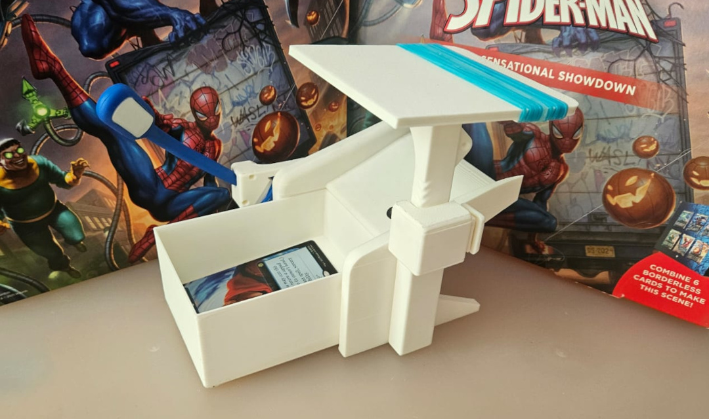

You can get the plans in [Onshape](https://cad.onshape.com/documents/3e6c0a39159cacd4128026c6/w/4eaf27fd4c1ac576c02eefac/e/cf0dfa73e00b3c8fb2858fbe?renderMode=0&uiState=69010f9acb89d229bf5b442d)

Print Profile in [Maker World](https://makerworld.com/es/models/1938737-carddrop-3-5#profileId-2081977)

# Updates

- 2026-04-08 - Box Small Fast, ideal for Bulk Scan
- 2025-11-05 - Small update, easier to print phone stand base. Maker World print profile updated.
- 2025-10-29 - v3.5 Initial Public Version.

# Print

* Tested in Bambu Lab A1 Mini
    * 0.16 mm Optimal is recommended for 0.4 Nozzle
    * 0.18 mm Fine is recommended for 0.6 Nozzle 
* Can be printed without supports
* White PLA or PLA+ is recommended
    * Tested with Filanova PLA+ Platinum White
* A 4 mm brim is recommended for the phone stand base

Files:  

* Main Body
    * [Body](files/body.stl)
* Box - Choose 1 or more (see [Box Comparison](#box-comparison))
    * [Box Universal](files/box_universal.stl) (Recommended)    
        * Recommended for sleeved cards (Dragon Shield and similar)
        * Good for unsleeved cards, perfect fit or similar
    * [Box Small](files/box_small.stl)   
        * Recommended for unsleeved cards, perfect fit or similar
    * [Box Sleeved](files/box_sleeved.stl)  
        * Recommended for sleeved cards (Dragon Shield and similar)
    * Box Small Fast - [Box](files/box_small_fast_-_box.stl)/[Platform](files/box_small_fast_-_plataform.stl)   
        * Collapsible platform box
        * Recommended for unsleeved cards, perfect fit or similar, ideal for Bulk Scan
* Phone Stand   
    * [Stand](files/phone_stand.stl)
    * [Base](files/phone_stand_base.stl)
    * [Button](files/phone_stand_base_-_button.stl)  
    * [Top](files/phone_stand_base_-_top.stl)
    * [Spring](files/phone_stand_base_-_spring.stl)  
* Optionals
    * Light   
        * Option A (Recommended)
            * [Base](files/a_light_flex_-_base.stl)     
            * [Press](files/a_light_flex_-_press.stl)    
            * [Cover](files/a_light_flex_-_cover.stl)  
        * Option B
            * [Clip](files/b_light_clip.stl)      
            * [Cable Clip](files/b_light_cable_clip.stl)  
            * [Diffuser](files/b_light_diffuser.stl) (Print with 100% rectilinear infill)   
    * Caps
        * [Caps left/right side](files/caps_side.stl)      
        * [Caps back](files/caps_back.stl)     

# Modules

## Main Body

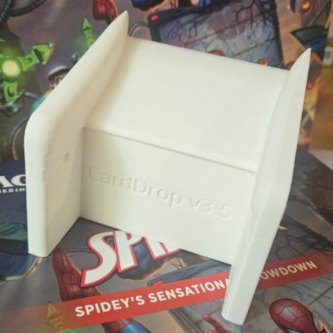

The main body has 4 locks for modules

* Dimple Locks in the front (for boxes)
* Left Clip  
* Right Clip 
* Back Clip

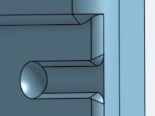
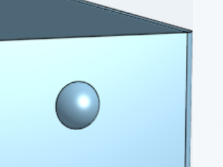
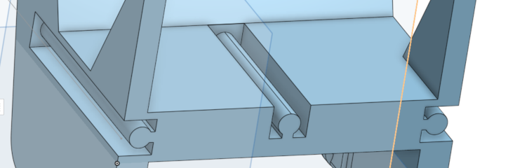

## Phone Stand

Features  

* Adjustable height with a locking button
* 7.5 degrees of inclination for better phone view
* Rubber band support for anti-slip
* Rail Clip for expansions

What you need

* 9 rubber bands (optional)
* Small M3 screw (option 1)
* SuperGlue/Loctite (option 2)

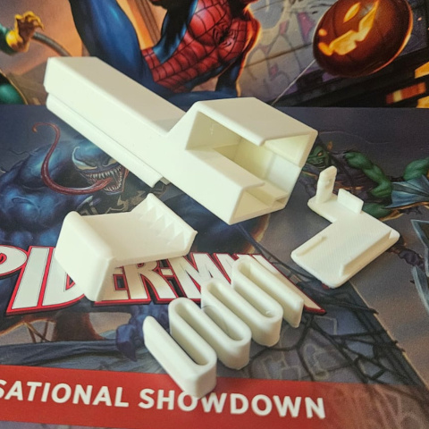
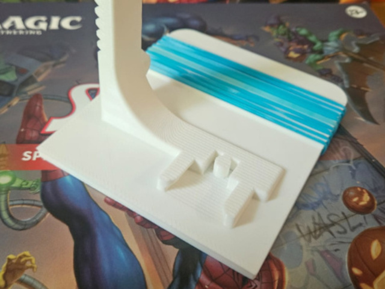
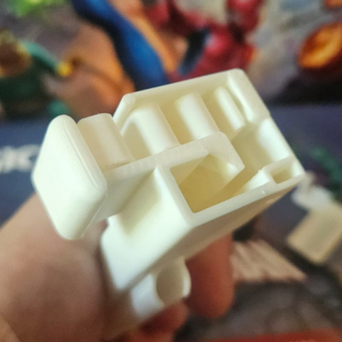
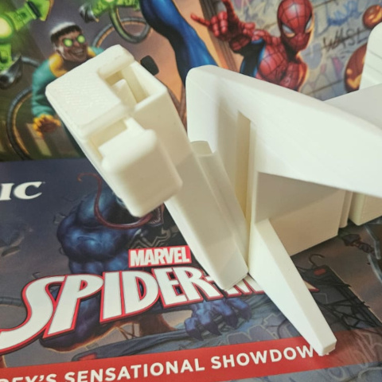
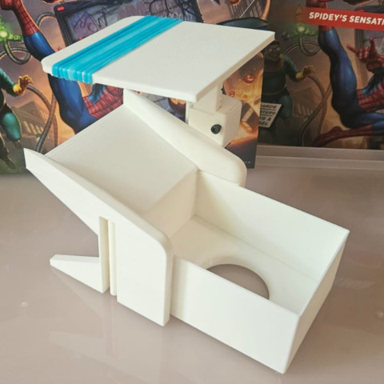

## Box Comparison

| Box | Sleeved cards | Unsleeved cards | Bulk Scan |
|-----|:---:|:---:|:---:|
| **Universal** (Recommended) | Yes | Good | - |
| **Small** | - | Yes | - |
| **Sleeved** | Yes | - | - |
| **Small Fast** | - | Yes | Yes |

## Box Universal (Option A) (Recommended)

Recommended for sleeved cards (Dragon Shield and similar).

Also works with unsleeved cards, but not perfectly — sometimes part of the previous card is visible, which can confuse the scanner. A 7.5-degree angle in the base of the box helps mitigate this issue.

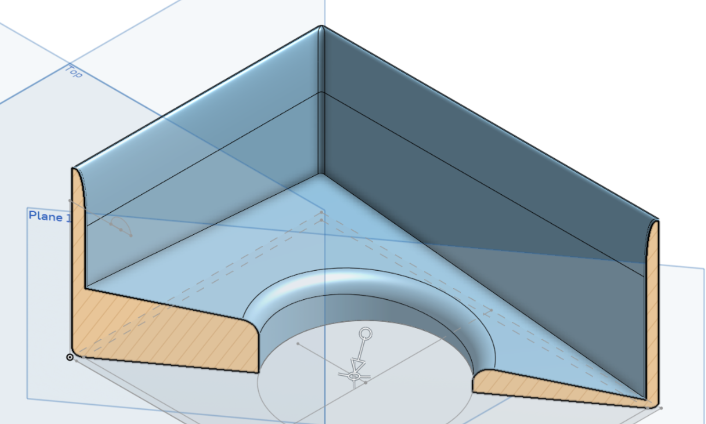

## Box Small (Option B)

Recommended for unsleeved cards and "perfect fit" sleeves or similar.

## Box Sleeved (Option C)

Optimized for sleeved cards (Dragon Shield or similar). The Universal Box is recommended instead.

## Box Small Fast (Option D)

Recommended for unsleeved cards, perfect fit or similar, ideal for Bulk Scan.

## Light (Option A) (Recommended)

What you need

* Flexible USB light
    * Amazon USA [link](https://www.amazon.com/-/es/Kyfreshpower-flexible-nocturna-compatible-computadora/dp/B09ZQSD1HX/ref=sr_1_6?__mk_es_US=%C3%85M%C3%85%C5%BD%C3%95%C3%91&sr=8-6)
    * Mercadolibre Argentina [link](https://articulo.mercadolibre.com.ar/MLA-904784238-luz-led-lampara-notebook-portatil-flexible-usb-linterna-_JM?searchVariation=174994919097#polycard_client=search-nordic&searchVariation=174994919097&search_layout=stack&position=3&type=item&tracking_id=c5f1e52d-9db7-45ab-b59f-fe4a51991974)
    * Aliexpress [link](https://es.aliexpress.com/item/1005010212112114.html)
* Rubber band

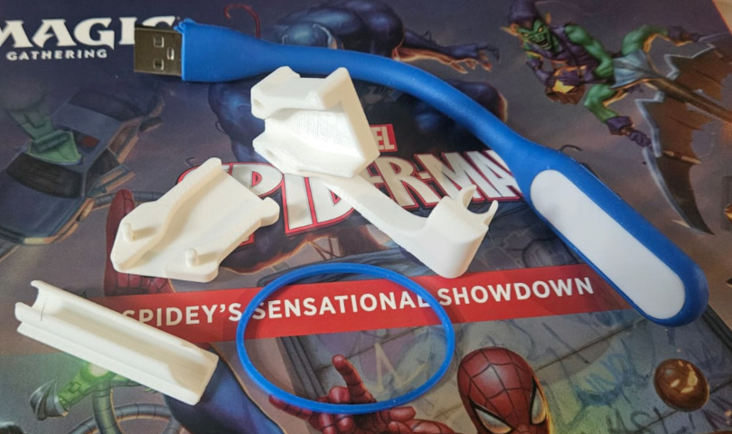
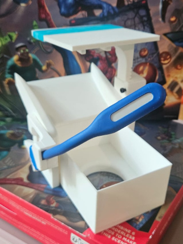

## Light (Option B) 

What you need

* 10 mm magnet, 2 mm of height.
* SuperGlue/Loctite (for the magnet)
* Cob rechargeable keychain light
    * Amazon USA [link](https://www.amazon.com/gp/aw/d/B0BL96CN37/?_encoding=UTF8&pd_rd_plhdr=t&aaxitk=ce103c393008308b57130dafb2e3f68b&hsa_cr_id=0&sr=1-2-f02f01d6-adaf-4bef-9a7c-29308eff9043&ref_=sbx__sbtcd2_asin_1_img)
    * Mercadolibre Argentina [link](https://articulo.mercadolibre.com.ar/MLA-2178066708-mini-linterna-led-cob-llavero-recargable-magnetico-potente-_JM?searchVariation=184274818784)
    * Aliexpress [link](https://es.aliexpress.com/item/1005008715044343.html)

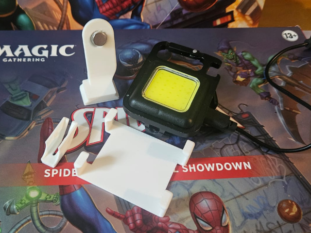
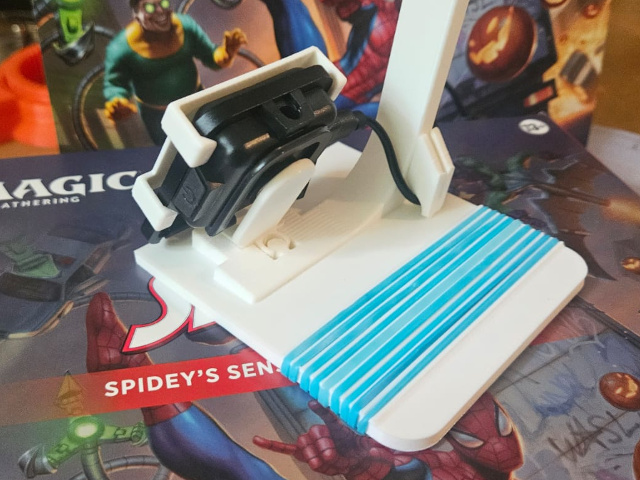
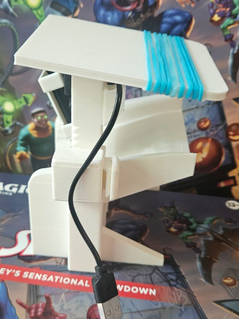

# Create your own modules / Remixes

You can see the plans in [Onshape](https://cad.onshape.com/documents/3e6c0a39159cacd4128026c6/w/4eaf27fd4c1ac576c02eefac/e/cf0dfa73e00b3c8fb2858fbe?renderMode=0&uiState=69010f9acb89d229bf5b442d)

For basic modules, the clip plans are this:

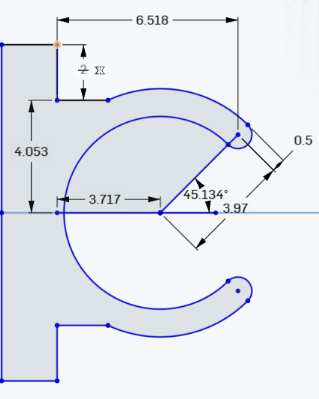

Height is 45 mm for the back clip, 60 mm for the laterals.

Reference model in this [link](files/clip.stl)    

For the slider clip (for the phone stand) you can use this reference model [link](files/slider_clip.stl)      

# License

Original design by Diego Vazquez - CC BY-SA 4.0 license - [Link](https://creativecommons.org/licenses/by-sa/4.0/deed.en). Modifications under the same license.

Notes:

* Remix allowed under the same license.
* You can print and sell this design, please give appropriate credit.
* You can create your own modules, please keep the same license.
